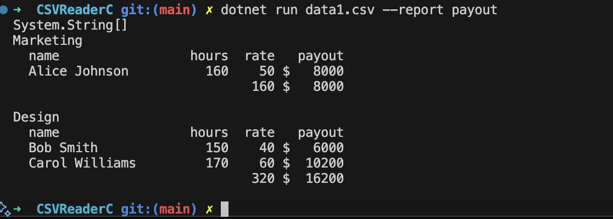

# 📊 CSVReader in C#

Консольное приложение на C#, которое читает CSV-файлы с данными сотрудников и формирует отчёты. Реализован отчёт `payout` — расчёт заработной платы сотрудников по отделам.

---

## 🚀 Запуск

Перейдите в директорию проекта:

```bash
cd CSVReaderReport
```

```bash
dotnet run -- data1.csv data2.csv --report payout
```

## 📤 Пример отчёта payout

```bash
Design
  name                   hours  rate  payout
  ------------------     -----  ----  -------
  Bob Smith                150    40  $ 6000
  Carol Williams           170    60  $10200
                           320        $16200

Marketing
  name                   hours  rate  payout
  ------------------     -----  ----  -------
  Alice Johnson            160    50  $ 8000
                           160        $ 8000
```


